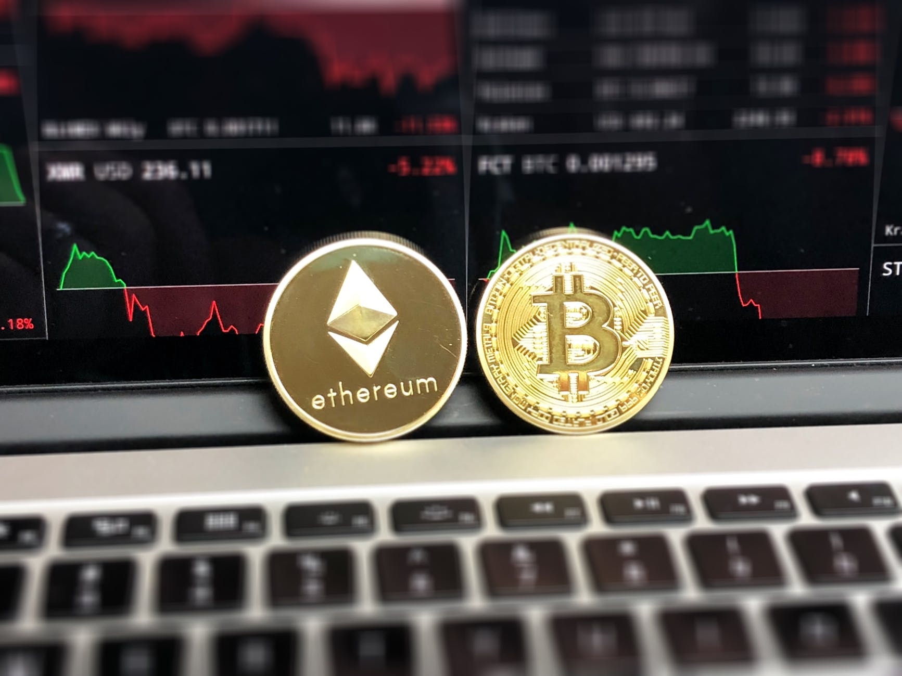
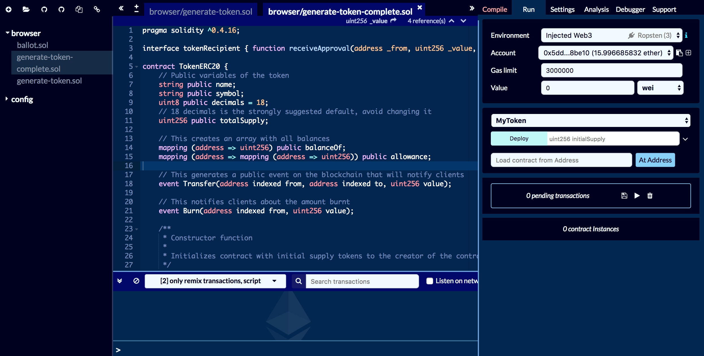
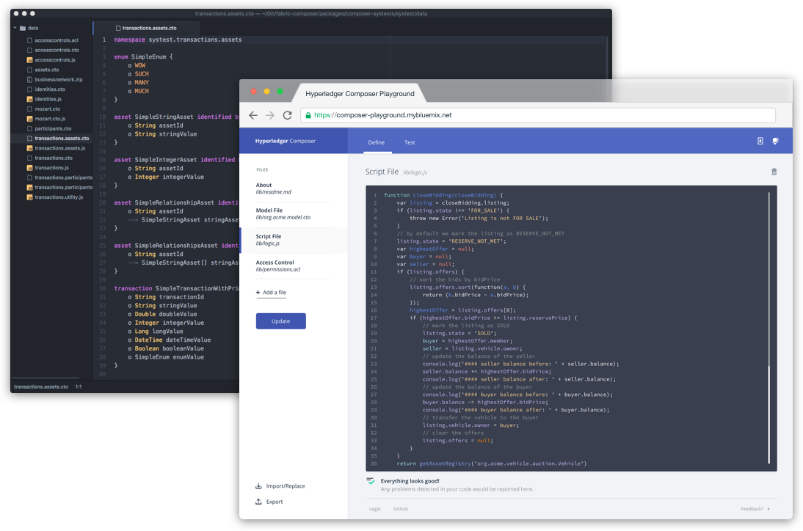
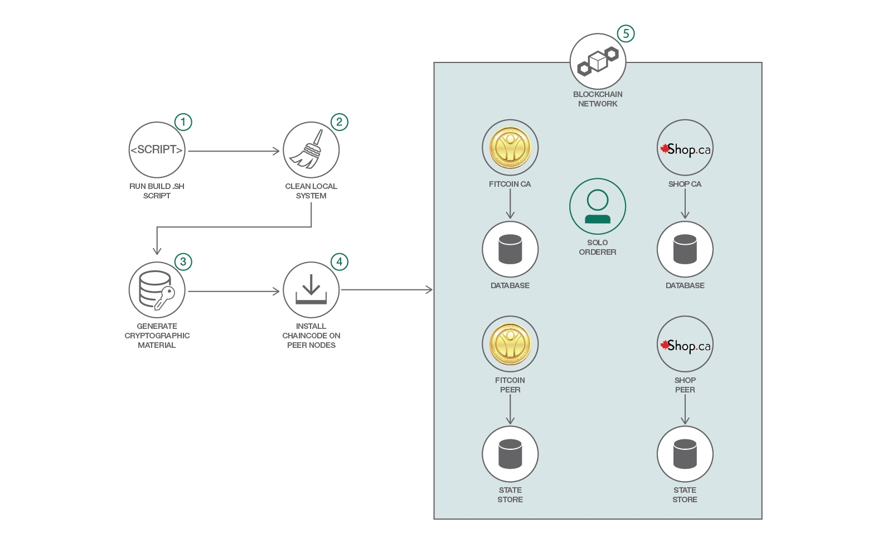

# Awesome Blockchain Kor - 모두를 위한 블록체인
> 사람들에게 블록체인에 대한 이해도를 높이고 사기(SCAM)를 막고자 본 레파지토리를 공개했습니다. 
>
> 함께 만들어가는 Repository라 생각합니다. 작업하면서 앞으로 작업할 내용은 [Project](https://github.com/yunho0130/awesome-blockchain-kor/projects/1)탭에 작성해두었습니다. Pull Request는 언제든지 환영합니다.
>
> 지식에 대한 접근성 향상을 위해 되도록 한글 자료를 중심으로 모았습니다. 그럼에도 불구하고, 꼭 언급해야할 자료가 영문일 경우에는 요약 설명을 추가했습니다. Pull Request를 주실 때, 이 점을 고려해주세요. 
>
> **Star와 Follow는 개발자를 춤추게 합니다. 더 빠른 업데이트와 양질의 자료를 원하신다면 꼭 눌러주세요.**

## 목차 (Table of Contents)

- [[일반인] 개인투자자 & 교양을 위한 블록체인](#일반인-개인투자자--교양을-위한-블록체인)
- [[현업종사자] CEO, 마케터, 기획자, 디자이너, 기관 투자자](#현업종사자-ceo-마케터-기획자-디자이너-기관-투자자)
- [[개발자] 개발자를 위한 실제 구현 및 이슈](#개발자-개발자를-위한-실제-구현-및-이슈)

## [일반인] 개인투자자 & 교양을 위한 블록체인

> 출처: Unsplash (Free use)

#### 배경지식  
- [컬럼] 욕망으로 읽어보는 블록체인: 코인과 화폐의 이해 => [reading-blockchain-via-desire](media/reading-blockchain-via-desire.md)    
#### ICO 참여하기 
- 진행중인 ICO 찾아보기 => <https://steemkr.com/coinkorea/@tyami/3-ico-1-ico>
- 블록체인 관련 기본 사이트 <https://steemit.com/kr/@yoon/3f8ty8>
- 기초 용어 이해하기 
    - Private Sale(프라이빗세일), Pre-Sale(프리세일), Public Sale(퍼블릭세일)/Crowd Sale(크라우드세일)/ Main Sale(메인세일), Soft cap(소프트캡), Hard cap(하드캡), White list(화이트리스트), KYC(Know Your Customer) 
    - <https://steemit.com/cryptocurrency/@andrewdoyon/whitelist-kyc-ico>
    - 실제 참가 가이드 (모스랜드) => <https://brunch.co.kr/@rrblog/34>
- 지갑생성 및 이더리움 전송
    - 메타마스크(Metamask) 사용법 1,2,3
        - <https://steemit.com/kr/@twinbraid/metamask-01>  
        - <https://steemit.com/kr/@twinbraid/metamask-02>  
        - <https://steemit.com/kr/@twinbraid/metamask-03>
- 비트코인 거래 수수료 => <https://steemit.com/kr/@twinbraid/fee-rate>
- 이더리움 거래시 발생하는 GAS
    - GAS Limit, Block GAS Limit, GAS Price, Total fee개념잡기 => <https://steemit.com/kr/@jinkim/gas-gas-limit-block-gas-limit-gas-price-total-fee>
    - 마이이더월렛 사용시 gwei 설정하는 법 => <https://steemit.com/kr/@kanghamin/gwei>
- 하드포크와 소프트 포크 => <https://tokenpost.kr/terms/11579>
- 에어드랍(Airdrop)과 스냅샷(Snapshot) => <https://tokenpost.kr/terms/11567>
    
#### ICO 한글 백서 모음 
- 추가나 업데이트를 원하시면 Pull Request 주세요.

| 프로젝트 명 | URL | 요약 | 백서 |
| :-----------: | :-----------: | :-----------: | :-----------: |
| 모스랜드 | <https://moss.land> | 위치기반 증강현실 모바일게임에 블록체인 적용 | [백서](/whitepapers/mossland/Mossland+Whitepaper+-+KOR.pdf) |
| 베리드 Berith | <https://www.berith.co> | POA 기반의 암호화폐 통합 및 지불결제 서비스 플랫폼 | [백서](/whitepapers/berith/BERITH_WhitePaper.pdf)
| 피블 Pibble | <https://www.pibble.io> | 이미지 기반 SNS 및 저작권 관리  | [백서](/whitepapers/pibble/PIBBLE_Whitepaper_KR_1.4.pdf)
    
#### 해킹과 보안 그리고 스캠
- 하드웨어 지갑 => <https://steemit.com/kr/@twinbraid/538vxn-2>
- 내가 참가한 ICO 프로젝트가 사기SCAM인지 구별하는 법
    - [암호화폐 이야기] ICO투자의 기준 => <https://steemit.com/hellocrypto/@donekim/ico> 
    - 사기SCAM 조회 사이트 => <https://steemit.com/kr/@ico-altcoin/ico-series-3>

- 내가 투자한 ICO 업체가 이더리움을 얼마나 쓰고 있나 감시하는 방법. 
    - 이더스캔 바로가기 => <https://etherscan.io/> 
    - 사용법 => <https://steemit.com/kr/@holcoin/https-etherscan-io>
    
- 거래소 해킹 시 보상 가능 여부(Alex Park, 2018) => [Alex Park님, Medium 링크](https://medium.com/hexlant/%EA%B1%B0%EB%9E%98%EC%86%8C-%ED%95%B4%ED%82%B9-%EC%8B%9C-%EB%B3%B4%EC%83%81-%EA%B0%80%EB%8A%A5-%EC%97%AC%EB%B6%80%EC%97%90-%EB%8C%80%ED%95%9C-%ED%86%A0%ED%81%B0-%EC%BB%A8%ED%8A%B8%EB%9E%99%ED%8A%B8-%EC%BD%94%EB%93%9C-%EB%B6%84%EC%84%9D-ad40fc35a845)

## [현업종사자] CEO, 마케터, 기획자, 디자이너, 기관 투자자

> (출처: pexels) 
#### 백서 작성하기 
- 블록체인 생태계 플레이어(Player)들 간의 역할 지도: 비즈니스 모델 및 생태계 이해 => <http://verticalplatform.kr/archives/10015> 
- ICO 트릴레마(ICO Trillema)
    - i)토큰의 총 발행량, ii)토큰의 가격, iii)토큰의 사후적 분배율 세가지가 동시에 고정될 수 없는 문제  => [정순형님, Medium 링크](https://medium.com/onther-tech/ico-%ED%8A%B8%EB%A6%B4%EB%A0%88%EB%A7%88-trillema-ico-%EC%82%BC%EC%9C%84%EC%9D%BC%EC%B2%B4%EB%B6%88%EA%B0%80%EB%8A%A5%EC%84%B1-87c6d9233a78)
- [컬럼] ICO(Initial Coin Offering)의 이해와 프라이빗 블록체인(Private Blockchain): 퍼블릭과 프라이빗 선택 가이드 라인 => [understanding-ico-and-private-blockchain](media/understanding-ico-and-private-blockchain-KOR-.md)
    - 요즘에는 Permissionless vs Permissioned 라는 용어도 사용.
- [기타] 크립토 앵커(Crypto-anchors): IoT 이력 추적 기술을 블록체인과 접목 (Itworld, 2018) <http://www.itworld.co.kr/news/108616>

#### 대표적인 1,2,3세대 블록체인 백서 스터디하기
| 세대 구분 | 프로젝트 명 | 백서 | 출처 |
| :-----------: | :-----------: | :-----------: | :-----------: |
| 3세대 | 이오스 EOS | [백서](/whitepapers/eos/TechnicalWhitePaper.md) | [이태민님 번역](https://github.com/bookchainio/eos-docs/blob/master/ko-KR/TechnicalWhitePaper.md)
| 2세대 | 이더리움 Ethereum | [백서](/whitepapers/ethereum/ethereum-whitepaper-official-wiki.md) | [공식 Github위키](https://github.com/ethereum/wiki/wiki/%5BKorean%5D-White-Paper)
| 1세대 | 비트코인 Bitcoin | [백서](/whitepapers/bitcoin/bitcoin_kor.pdf) | [츄이스님 번역](https://www.ddengle.com/board_free/205187) | 

#### 그 외에 읽어볼 만한 백서 
- 추가나 업데이트를 원하시면 Pull Request 주세요.

| 프로젝트 명 | URL | 요약 | 백서 | 출처 |
| :-----------: | :-----------: | :-----------: | :-----------: | :-----------: |
| 아이콘 | <https://icon.foundation> | 루프체인 기반 높은 TPS의 프라이빗 블록체인 | [백서](/whitepapers/icon/ICON-Whitepaper-KO-Draft.pdf) | 공식  |
| 스팀 | <https://steem.io/> | 블록체인 기반의 블로깅 플랫폼 | [백서](https://github.com/taeminlee/blockchain.eos/blob/master/20170901%20steem%20white%20paper.md) | 이태민님 github |
| 에이다 | <https://www.cardano.org/> | 상호 검증가능한 프로토콜을 통한 보안성 강화 |   [백서](/whitepapers/ada/WhyCardanoKR.pdf) | 공식 |

#### ICO 진행하기 
- 스타트업의 일반적 ICO 프로세스 => <http://verticalplatform.kr/archives/9772>
- 국가별 ICO 규제 현황 (영문, 단 표로 잘 정리되어 있어서 보기 편함) => [Initial coin offering and platform building ](media/Initial%20coin%20offering%20and%20platform%20building%20-1.pdf)
- 나만의 토큰 코인을 발행하는 쉬운 방법 (ICO) => <https://steemit.com/kr/@newtoken/ico>
- 토큰뱅크로 ICO 토큰 발행 위탁하기 => <https://tokenbank.co.kr/>

## [개발자] 개발자를 위한 실제 구현 및 이슈

#### (Optional) 윈도우 환경에서 파일 이름 길이 제한으로 인한 Git Clone 에러 대처법 
```git config --system core.longpaths true``` [참고](https://stackoverflow.com/questions/22575662/filename-too-long-in-git-for-windows)

#### 주로 사용되는 개념들 
* [블록체인 기초개념] 컨센서스(Consensus)란 무엇인가? - PoW/PoS/DPoS 알아보기 => <https://steemit.com/kr/@donekim/consensus-pow-pos-dpos> 
    - PoW: 컴퓨팅 파워를 통해 블록체인 네트워크에 전송된 암호화된 거래정보를 푼 뒤, 새로운 블록을 체인에 연결하는 작업증명 방식
    - PoS: 특정 시스템에서 지분을 많이 보유한 사람이 자신의 지분 가치를 하락시키는 일은 하지 않을 것이라 가정하에 진행되는 컨센서스 알고리즘(류영훈, 2018).
    - DPoS: 상위 노드에 권한을 위임하고, 위임받은 노드들이 거래를 검증. 
* [블록체인 기초개념] 컨센서스(Consensus)란 무엇인가? - 비잔틴 장군문제(BGP)란? => <https://steemkr.com/kr/@donekim/consensus-bgp>    
- 넴(NEM)을 통한 PoI이해  => <https://tokenpost.kr/terms/6867>
- 방향성 비순환 그래프 DAG(Directed Acyclic Graph) IOTA 등 => <https://steemkr.com/kr/@sjchoi/adk-3-0-dag-directed-acyclic-graph>
- 영지식 증명(Zero-Knowledge Proof): 익명성 코인 Z-Cash 등 => <https://www.ventascorp.com/news/?mod=document&uid=38>
- 토큰 소각 '토큰 디자인 패턴 시리즈 #3 :: Means of Exchange의 Burn & Mint 패턴' => [Medium 링크](https://medium.com/@chajesse/%ED%86%A0%ED%81%B0-%EB%94%94%EC%9E%90%EC%9D%B8-%ED%8C%A8%ED%84%B4-%EC%8B%9C%EB%A6%AC%EC%A6%88-3-means-of-exchange%EC%9D%98-burn-mint-%ED%8C%A8%ED%84%B4-88663d3f7cc)
- 세그윗(Segwit) => <https://www.ventascorp.com/news/?mod=document&uid=21>
- 머클 트리(Merkle Tree), 풀노드(Full Node), 라이트 노드(Light Node) => <https://steemit.com/kr/@jsralph/merkle-trees>
- 51%공격: 채굴 노드가 특정인/단체에게 51%가 넘어가는 순간 채굴로 유지되는 블록체인은 위험해짐 => <https://steemit.com/kr-join/@jsralph/51>

#### 이더리움 프로그래밍 (Solidity)


* 이더리움 프로그래밍 언어인 Solidity는 튜링 완전한 언어 <https://steemit.com/kr/@jumsun/eth-ethereum-1-turing-complete>
* 이더리움 트렌젝션의 실행
 <https://steemit.com/ethereum/@sigmoid/4mtmow>
* 이더리움 주석 한글화 프로젝트 <https://github.com/NAKsir-melody/go-ethereum>
* 이더리움 분석기 <https://docs.google.com/presentation/d/1IEoHhCP83uEQLf3e5IrwVUn6gTZXIeJ8xzPzd1XcXvQ/edit#slide=id.p5> 
* 이더리움 창시자, 비탈릭 부테린이 작성한 용어 가이드 DAOs, DACs, DAs and More: An Incomplete Terminology Guide 한글번역 => <https://atomrigs.blogspot.com/2015/02/dao-dac.html>
* 공식 홈페이지 제공 Solidity 소스코드  
    - ERC20 기반 토큰 생성 코드: 최소 기능 버전 MVP(Minimum Viable Product) => <https://github.com/yunho0130/awesome-blockchain-kor/blob/master/ethereum-token-v0.1/generate-token.sol>
    - ERC20 기반 토큰 생성 코드: 보다 완성된 버전(More Complete) 코드 => <https://github.com/yunho0130/awesome-blockchain-kor/blob/master/ethereum-token-v0.1/generate-token-complete.sol>

* Solidity의 재밌는 학습을 위한 사이트 CryptoZombie <https://cryptozombies.io/ko/>

* 유윤재님의 Solidity 튜토리얼 시리즈 (truffle + zeppelin-solidity을 이용한 크라우드 세일 계약)        
    - <https://medium.com/dnext-post/solidity-tutorial-1-252c9edf2f84>
    - <https://medium.com/dnext-post/solidity-tutorial-2-e26a57c8fdd1>
    - <https://medium.com/dnext-post/solidity-tutorial-3-e163f6de5ab5>
    - <https://medium.com/dnext-post/solidity-tutorial-4-7a048c76d8e4>
    - <https://medium.com/dnext-post/solidity-tutorial-5-85dfe51dcd54>
    - <https://medium.com/dnext-post/solidity-tutorial-6-543bd342d928>
    
* Udemy Solidity 온라인 강의 (영문, 유료) MOOC: [10$ 쿠폰](https://dealsea.com/view/udemy.com) => [기초 개념](https://www.udemy.com/blockchain-and-bitcoin-fundamentals/) =>  [Solidity](https://www.udemy.com/ethereum-and-solidity-the-complete-developers-guide)
    
* 이더리움 ERC20 취약점(ethereum-ERC20-vulnerability)
    - 기본적인 Overflow/Underflow 취약점 (safemath 사용 권장)
        - 이더리움 공식 홈페이지에서 제공하는 ERC20 소스코드 중 `transfer` 기능에 사용하는 경우 Overflow/Underflow 결함이 발견. 이로 인해 ERC20 코인들 중, 본 결함으로 인해 손실된 금액은 약 300만 달러(2017년 12월 27일 기준). 
        - [SMT(SmartMesh) 토큰 무한생성 해킹 설명과 대비책 (출처: 온더)](https://medium.com/onther-tech/smt-%ED%86%A0%ED%81%B0-%EC%9D%B4%EC%A4%91%EC%A7%80%EB%B6%88-%ED%95%B4%ED%82%B9-%EC%84%A4%EB%AA%85%EA%B3%BC-%EB%8C%80%EB%B9%84%EC%B1%85-8bef3f41bcd2)
    - Nothing-at-Stake: 네트워크상에 두 개 이상의 포크가 있을 경우, 양쪽에 동시에 베팅하는 것. PoS의 경우 자산 증명의 한계 비용이 없기 때문에 가능한 일. 이더리움은 디포짓과 패널티를 통해 해결하려 하고 있음.
    - [스마트 컨트렉트 보안: 6개의 솔리디티 취약점 및 그에 대한 대비책 (파트 1)](https://medium.com/@ihcho131313/%EC%8A%A4%EB%A7%88%ED%8A%B8-%EC%BB%A8%ED%8A%B8%EB%A0%89%ED%8A%B8-%EB%B3%B4%EC%95%88-6%EA%B0%9C%EC%9D%98-%EC%86%94%EB%A6%AC%EB%94%94%ED%8B%B0-%EC%B7%A8%EC%95%BD%EC%A0%90-%EB%B0%8F-%EA%B7%B8%EC%97%90-%EB%8C%80%ED%95%9C-%EB%8C%80%EB%B9%84%EC%B1%85-%ED%8C%8C%ED%8A%B8-1-f4f32d19a558) 
    - 그 외의 취약점에 대한 레퍼런스 (출처: 온더) => <https://github.com/Onther-Tech/auditing-reference>
    - [금융권 도입시 보안 고려사항, 출처: 금융보안원](https://github.com/yunho0130/awesome-blockchain-kor/blob/master/media/%EB%B8%94%EB%A1%9D%EC%B2%B4%EC%9D%B8%20%EA%B8%B0%EC%88%A0%EA%B3%BC%20%EB%B3%B4%EC%95%88%20%EA%B3%A0%EB%A0%A4%EC%82%AC%ED%95%AD_vFN.pdf)
    - 맹개발의 개인적인 의견으로는, 비즈니스 로직을 구현한 뒤에 전문 보안감사(Security Audit)업체를 통해 취약성 검증하는 것을 추천함. Audit과정에서 개발팀의 기술적인 성숙도 노려볼 수 있을 것임. 

* 트랜잭션이 느리고, 처리량이 모자라고, 수수료가 비쌀 때. 
    - 온 체인 트랜잭션, 오프 체인 트랜잭션, 사이드 체인, 차일드 체인, 지불 채널, 인터체인
블록체인 => <https://steemit.com/kr-dev/@modolee/onchain-offchain>
    - PBTF([Practical-Byzantine-Fault-Tolerance](media/Practical-Byzantine-Fault-Tolerance.pdf))란? 고속트랜잭션 처리를 위해 설계되어 초당 수천만 건의 트랜잭션을 처리할 수 있다(김용재 등, 2018). 현재 it chain 등에서 활용. 
    - 플라즈마(Plasma), 라이덴(Raiden) 그리고 샤딩(Sharding) => <https://cryptokiwi.kr/currency?id=eth&category=2&content_id=227>

#### 하이퍼레저 프로그래밍 (Hyperledger Fabric & composer)


* 하이퍼레저 장점
    - 컴포져라는 접근성 좋은 툴, 기존 시스템과의 연동성, 다양한 개발 언어 지원(Go, Node.js, Java), 데이터 백업/복구, BaaS(Blockchain as a Service)로 빠른 개발 가능.
* 비즈니스 네트워크 아카이브 (Business Network Archive, BNA)
    - 하이퍼레저 컴포저라는 개발툴을 통해 생성된 파일로 블록체인 망에 배포할 때 스마트 컨트랙트가 자동으로 생성(허강욱, 2018).

> Hyperledger Fabric V1.1을 활용한 Deployment 예시 (출처: DeveloperWorks)
* 하이퍼레저 컴포저 - 스마트 컨트랙트 => [1단계: 한글 Readme.md](https://github.com/yunho0130/awesome-blockchain-kor/blob/master/hyperledger/developerworks/BlockchainNetwork-CompositeJourney-master/README-ko.md)
* 하이퍼레저 컴포저 - 상품 경매 네트워크 => [2단계: 한글 Readme.md](https://github.com/yunho0130/awesome-blockchain-kor/blob/master/hyperledger/developerworks/BlockchainSmartContractTrading-CompositeJourney-master/README-ko.md)
* 하이퍼레져 패브릭 Node.js 배포 및 SDK 만들기 => [한글 Readme.md](https://github.com/yunho0130/awesome-blockchain-kor/blob/master/hyperledger/developerworks/Deployment-NodeSDK-master/README-ko.md)
* 하이퍼레져 패브릭 Python SDK => [fabric-sdk-py-master](/hyperledger/fabric-sdk-py-master/)
- IBM Cloud를 활용한 하이퍼레저 프로그래밍 시작하기 (DeveloperWorks 작성 예정)
- Hyperledger Composer 사용하기 (DeveloperWorks 작성 예정)
- 하이퍼레져와 이더리움 연동 (DeveloperWorks 작성 예정)

#### 자동 투자를 위한 거래소 API와 알고리즘 트레이딩 (퀀트 트레이딩) 
- 업비트 API Doc <https://docs.upbit.com/>
    - ubci R 패키지 <https://cran.r-project.org/web/packages/ubci/index.html>
- 빗썸 API Doc <https://www.bithumb.com/u1/US127>
- 코빗 API Doc <https://apidocs.korbit.co.kr/ko/>
    - python 패키지 <https://github.com/HoonJin/korbit-python>
    - php code <https://github.com/yks118/Korbit-api-php>
- GOPAX API Doc <https://gopaxapi.github.io/gopax/>
- 코인원 API Doc <http://doc.coinone.co.kr/>
- 해외 거의 모든 거래소 Python 트레이딩 라이브러리 (영문) => [Readme.md](/quant-trading/ccxt-master/README.md)
- 파이썬으로 배우는 알고리즘 트레이딩 <https://wikidocs.net/book/110>

#### 참고문헌 및 자료 @작업중
- Alex Park(2018), 거래소 해킹 시 보상 가능 여부에 대한 토큰 컨트랙트 코드 분석, Medium
- Castro, M., & Liskov, B. (1999). Practical Byzantine fault tolerance. In OSDI (Vol. 99, pp. 173-186).
- Li, J., & Mann, W. (2018). Initial coin offering and platform building.
- ITworld(2018), “낟알 크기 컴퓨터로 모조품 잡는다” 초소형 블록체인 컴퓨터 ‘크립토앵커’
- 류영훈(2018), 스팀과 스팀잇의 세계, 마이크로 소프트웨어: 체인빅뱅, 392호
- 김용재, 유동균, 이준범 등(2018), 나만의 프라이빗 블록체인 it-chain, 마이크로 소프트웨어: 체인빅뱅, 392호
- 허강욱(2018), 하이퍼레저 패브릭, 마이크로 소프트웨어: 체인빅뱅, 392호

#### Contributors 

- 홍승환 님 (harrydrippin) 
- 안재열 님 (jb7959)
- 박찬엽 님 (mrchypark) 
- 진영화 님 (jinyounghwa)
- mingrammer 님
- wooqii 님
- weyoui 님

#### 맹개발 <http://maengdev.tistory.com/166>
> 현재 IBM Watson Cognitive 엔지니어로 근무하고 있으며, 연세대학교 정보대학원에서 비즈니스 빅데이터 분석 석사과정을 전공했다. California에서 실시된 AutoDevBot 해커톤에서 비트코인 환율 체커를 안드로이드와 iOS용으로 제작하여 준우승하였으며, 카네기멜론 아시아 STEM Academy와 중앙대학교에서 Python을 강의했다. SK C&C, 한국과학기술정보연구원(KISTI), 한국연구재단(NRF), DBpia 등에서 프로젝트를 수행하였으며, 오픈소스 활동으로 Apache Zepplin, 양자컴퓨팅 Python SDK인 QISKIT에 기여했다. 최근에는 하이퍼레져와 ERC20간의 연동에 관심이 많다. 

#### Disclaimer
- 본 레파지토리는 몇몇의 블록체인 프로젝트들과 학습자료를 모아둔 곳입니다. 개인의 자격으로 운영되며 IBM과 관련이 없습니다. 또한, 본 레파지토리에 있는 코드를 사용할 경우 발생하는 모든 종류의  문제(기술적/보안적/법률적/etc)를 책임지지 않습니다. This repository is consist of several experimental blockchain project and learning materials. Not related to IBM. It's personal repository. So I have no responsibility for using this code about all kind of problems such as technical/security/legal/etc. 

