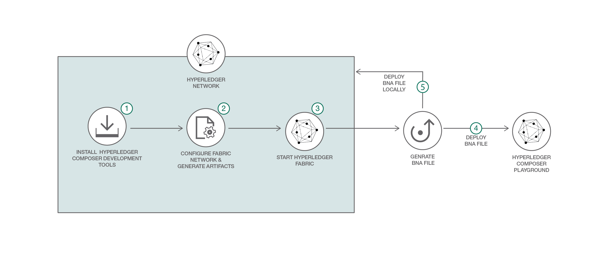
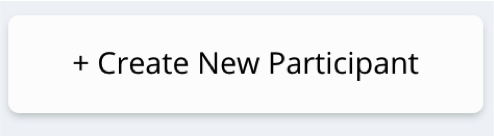
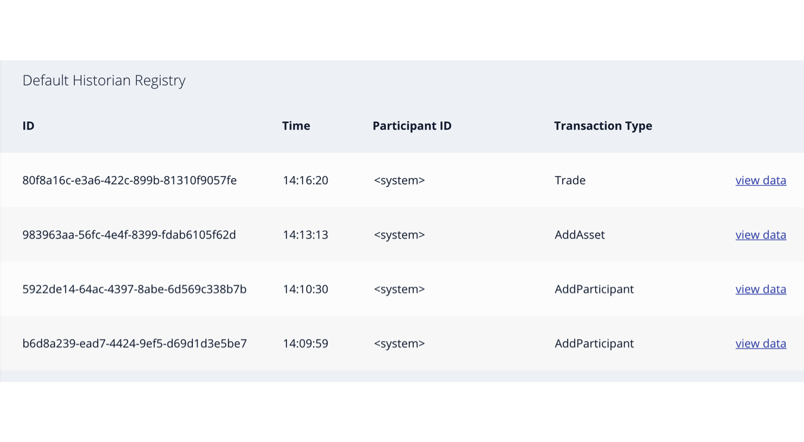

*阅读本文的其他语言版本：[English](README.md), [한국어](README-ko.md)。*
 # BlockchainNetwork-CompositeJourney

## 构建您的第一个网络 (BYFN)

欢迎来到构建区块链应用程序系列的第一部分。**第 1 部分**将介绍如何创建一个用于商品贸易的 Hyperledger Composer Business Network Archive (BNA) 文件，并将它部署在 Hyperledger Fabric 上。这是 Hyperledger Composer 样本中的最基础样本，所以初级开发人员就能管理他。这个 Code Pattern 已经更新，可以支持  Hyperledger Composer V0.19.0, Hyperledger Fabric V1.1。

Hyperledger Fabric 是一种区块链架构实现，也是 The Linux Foundation 主办的一个 Hyperledger 项目。Hyperledger Fabric 旨在作为开发具有模块化架构的应用程序或解决方案的基础，它允许即插即用地使用共识服务和成员服务等组件。

[第 2 部分](https://github.com/IBM/BlockchainBalanceTransfer-CompositeJourney)，我们将进一步探索创建包含多个参与者的复杂网络，并使用访问控制规则 (ACL) 为参与者提供网络访问权限。在本 developer journey 中，将在本地运行 Hyperledger Fabric。

可以使用 [Hyperledger Composer](https://github.com/hyperledger/composer) 为当前的业务网络快速建模，包括现有资产和与之相关的交易。资产包括有形或无形的商品、服务或财产。作为业务网络模型的一部分，您还要定义能与资产交互的交易。业务网络还包含跨多个业务网络与它们交互的参与者，每个参与者都可以与唯一身份关联。业务网络定义由模型 (.cto)、脚本 (.js) 和 ACL (.acl) 文件组成，它们都打包为归档文件（.bna 文件）并导出。然后，将该归档文件部署到 Hyperledger Fabric 网络中。

## 包含的组件
* Hyperledger Fabric
* Hyperledger Composer
* Docker

## 应用程序工作流图


1.安装网络依赖项 a) cryptogen b) configtxgen c) configtxlator d) peer

2.配置网络 a) 生成网络工件 b) 启动网络

## 前提条件

* [Docker](https://www.docker.com/products/overview) - v1.13 或更高版本
* [Docker Compose](https://docs.docker.com/compose/overview/) - v1.8 或更高版本
* [Node.js & npm](https://nodejs.org/en/download/) - node v6.2.0 - v6.10.0（不支持 v7 及更高版本）；npm 是 Node 安装的一部分。
* [Git 客户端](https://git-scm.com/downloads) - 执行克隆命令时需要它
*  git - 2.9.x
*  Python - 2.7.x

## 步骤
1.[安装 Hyperledger Composer 开发工具](#1-installing-hyperledger-composer-development-tools)

2.[启动 Hyperledger Fabric](#2-starting-hyperledger-fabric)

3.[生成 Business Network Archive (BNA)](#3-generate-the-business-network-archive-bna)

4.[使用 Composer Playground 部署 Business Network Archive](#4-deploy-the-business-network-archive-using-composer-playground)

5.[将 Business Network Archive 部署到在本地运行的 Hyperledger Composer 上](#5-deploy-the-business-network-archive-on-hyperledger-composer-running-locally)

## 1.安装 Hyperledger Composer 开发工具

**备注：**您可能需要在超级用户 `sudo` 模式下运行这些命令。根据安全策略的规定，`sudo` 允许授权用户以超级用户或另一个用户的身份执行命令。另外，你需要安装最新的 composer-cli (0.19.1)。如果你已经安装了就版本，请先使用以下命令删除它：

```
npm uninstall -g composer-cli
```

* `composer-cli` 包含用于开发业务网络的所有命令行操作。要安装 `composer-cli`，请运行以下命令：
```
npm install -g composer-cli@0.19.1
```

* `generator-hyperledger-composer` 是一个 Yeoman 插件，用于为您的业务网络创建定制的（也就是自定义的）应用程序。Yeoman 是一个开源客户端开发堆栈，包含帮助开发人员构建 Web 应用程序的工具和框架。要安装 `generator-hyperledger-composer`，请运行以下命令：
```
npm install -g generator-hyperledger-composer@0.19.1
```

* `composer-rest-server` 使用 Hyperledger Composer LoopBack Connector 连接到业务网络，提取模型，然后呈现一个页面，其中包含已经为该模型生成的 REST API。要安装 `composer-rest-server`，请运行以下命令：
```
npm install -g composer-rest-server@0.19.1
```

* 将 `Yeoman` 与 `generator-hyperledger-composer` 组件结合使用时，它可以解释业务网络并基于这些网络生成应用程序。要安装 `Yeoman`，请运行以下命令：
```
npm install -g yo@2.0.0
```

## 2.启动 Hyperledger Fabric

首先下载 Fabric 的 Docker 文件，为创建 Composer 配置文件做好准备。Hyperledger Composer 使用连接配置文件连接到运行时。连接配置文件是一个 JSON 文档，位于用户的主目录中（或者可能来自一个环境变量），在使用 Composer API 或命令行工具时，可以按名称引用它。使用连接配置文件确保代码和脚本能在运行时实例之间轻松移植。

PeerAdmin 卡片是一个用于识别本地 Hyperledger Fabric 管理人员。在安装开发过程中（例如在你的计算机上），当你创建本地 Hyperledger Fabric 时会同时创建 PeerAdmin ID 卡。

Hyperledger Fabric v1.0 网络的 PeerAdmin 卡的形式是 PeerAdmin@hlfv1，一般来说，PeerAdmin 一般是一个特殊角色，可以用于以下功能：

* 开发业务网络
* 为业务网络 admins* 创建、分配、撤销 ID 卡。

使用以下命令启动 Fabric 并创建一个 Composer 配置文件：
```bash
./downloadFabric.sh
./startFabric.sh
./createComposerProfile.sh
```  

现在不需要这么做；但是作为参考，您可以使用以下命令停止并关闭 Fabric：
```
./stopFabric.sh
./teardownFabric.sh
```

## 3.生成 Business Network Archive (BNA)

这个业务网络定义了以下内容：

**参与者**
`贸易方`

**资产**
`商品`

**交易**
`贸易`

`商品`归一位`贸易方`所有，可通过提交`贸易`交易来修改`商品`的所有者。

下一步是为业务网络定义生成一个 Business Network Archive (BNA) 文件。BNA 文件是可部署的单元 - 一个可部署到 Composer 运行时上执行的文件。

使用以下命令生成网络归档文件：
```bash
npm install
```
您应该看到以下输出：
```bash
Creating Business Network Archive

Looking for package.json of Business Network Definition
	Input directory: /Users/ishan/Documents/git-demo/BlockchainNetwork-CompositeJourney

Found:
	Description: Sample Trade Network
	Name: my-network
	Identifier: my-network@0.0.1

Written Business Network Definition Archive file to
	Output file: ./dist/my-network.bna

Command succeeded
```

`composer archive create` 命令在 `dist` 文件夹中创建了一个名为 `my-network.bna` 的文件。

可以针对一个嵌入式运行时来测试业务网络定义，该运行时在一个 Node.js 进程中将“区块链”的状态存储在内存中。这个嵌入式运行时对单元测试非常有用，因为它使您能集中精力测试业务逻辑，而不是配置整个 Fabric。
从项目工作目录 (`BlockchainNetwork-CompositeJourney`)，运行以下命令：
```
npm test
```

您会看到以下输出：
```bash

> my-network@0.0.1 test /Users/laurabennett/2017-NewRole/Code/BlockchainNetwork-CompositeJourney
> mocha --recursive

Commodity Trading
    #tradeCommodity
      ✓ should be able to trade a commodity (198ms)


  1 passing (1s)
```

## 4.使用 Composer Playground 部署 Business Network Archive

打开 [Composer Playground](http://composer-playground.mybluemix.net/)，其中已在默认情况下导入基本样本网络。
如果以前使用过 Playground，一定要在浏览器控制台中运行 `localStorage.clear()` 来清除浏览器本地存储。

现在导入 `my-network.bna` 文件并单击 deploy 按钮。如果你不知道如何导入，查看一下 [tour of Composer Playground](https://www.youtube.com/watch?time_continue=29&v=JQMh_DQ6wXc)

>也可以[在本地设置 Composer Playground](https://hyperledger.github.io/composer/installing/using-playground-locally.html)。

您会看到以下信息：
<p align="center">
  
</p>

要测试您的业务网络定义，请先单击 **Test** 选项卡：

单击 `Create New Participant` 按钮
<p align="center">
  
</p>


创建 `Trader` 参与者：

```
{
  "$class": "org.acme.mynetwork.Trader",
  "tradeId": "traderA",
  "firstName": "Tobias",
  "lastName": "Funke"
}

{
  "$class": "org.acme.mynetwork.Trader",
  "tradeId": "traderB",
  "firstName": "Simon",
  "lastName": "Stone"
}
```

突出显示最左侧的 Commodity 选项卡，
创建一个所有者为 `traderA` 的 `Commodity` 资产：
```
{
  "$class": "org.acme.mynetwork.Commodity",
  "tradingSymbol": "commodityA",
  "description": "Sample Commodity",
  "mainExchange": "Dollar",
  "quantity": 100,
  "owner": "resource:org.acme.mynetwork.Trader#traderA"
}
```

单击左下侧的 `Submit Transaction` 按钮，提交一个 `Trade` 交易来更改商品 `commodityA` 的所有者：
```
{
  "$class": "org.acme.mynetwork.Trade",
  "commodity": "resource:org.acme.mynetwork.Commodity#commodityA",
  "newOwner": "resource:org.acme.mynetwork.Trader#traderB"
}
```

可以单击 `Commodity` 注册表来验证新的所有者。也可以选择 `All Transactions` 注册表来查看所有交易。

交易视图示例：
<p align="center">
  
</p>

## 5. 将 Business Network Archive 部署到在本地运行的 Hyperledger Composer 上（可选部署方法）

将业务网络部署到 Hyperledger Fabric 需要将 Hyperledger Composer 链代码安装在对等节点上，然后必须将业务网络归档文件 (.bna) 发送给该对等节点，而且必须创建一个新参与者、身份和关联卡作为网络管理员。最后，必须导入网络管理员业务网络卡供使用，然后对该网络执行 ping 操作来检查它是否会响应。

将目录更改到包含 `my-network.bna` 文件的 `dist` 文件夹。

`composer runtime install` 命令需要一个 PeerAdmin 业务网络卡（在这里已提前创建并导入了一个卡），以及业务网络的名称。要安装 Composer 运行时，请运行以下命令：
```
cd dist
composer runtime install --card PeerAdmin@hlfv1 --businessNetworkName my-network
```

`composer network start` 命令需要一个业务网络卡，以及业务网络的管理员身份的名称、`.bna` 的文件路径和要创建的适合导入作为业务网络卡的文件名称。要部署业务网络，请运行以下命令：
```
composer network start --card PeerAdmin@hlfv1 --networkAdmin admin --networkAdminEnrollSecret adminpw --archiveFile my-network.bna --file networkadmin.card
```

`composer card import` 命令需要使用 `composer network start` 中指定的文件名来创建一个卡。要导入网络管理员身份作为适用的业务网络卡，请运行以下命令：
```
composer card import --file networkadmin.card
```

可以键入以下命令来验证网络已部署：
```
composer network ping --card admin@my-network
```

您会看到以下输出：
```
The connection to the network was successfully tested: my-network
	version: 0.16.0
	participant: org.hyperledger.composer.system.NetworkAdmin#admin

Command succeeded
```

要与已部署的业务网络集成（创建资产/参与者并提交交易），可以使用 Composer Node SDK 或生成一个 REST API。要创建 REST API，需要启动 `composer-rest-server`，告诉它如何连接到我们已部署的业务网络。现在启动该服务器，方法是将目录更改到项目工作目录，并键入以下内容：
```bash
cd ..
composer-rest-server
```

回答启动时提出的问题。这些信息使得 composer-rest-server 能连接到 Hyperledger Fabric，并配置如何生成 REST API。
* 输入 `admin@my-network` 作为卡名称。
* 在询问是否在生成的 API 中使用名称空间时，选择 `never use namespaces`。
* 在询问是否保护生成的 API 时，选择 `No`。
* 在询问是否启用事件发布时，选择 `Yes`。
* 在询问是否启用 TLS 安全性时，选择 `No`。

如果 composer-rest-server 成功启动，您会看到以下两行输出：
```
Discovering types from business network definition ...
Discovered types from business network definition
Generating schemas for all types in business network definition ...
Generated schemas for all types in business network definition
Adding schemas for all types to Loopback ...
Added schemas for all types to Loopback
Web server listening at: http://localhost:3000
Browse your REST API at http://localhost:3000/explorer
```

打开 Web 浏览器并导航到 http://localhost:3000/explorer

您会看到 LoopBack API Explorer，可以检查和测试已生成的 REST API。按照上面的 Composer 部分给出的说明来测试业务网络定义。

## 准备执行第 2 步！
恭喜您 - 您已经完成这个系列学习之旅的第 1 步 - 请继续执行[第 2 步](https://github.com/IBM/BlockchainBalanceTransfer-CompositeJourney).

## 其他资源
* [Hyperledger Fabric 文档](http://hyperledger-fabric.readthedocs.io/en/latest/)
* [Hyperledger Composer 文档](https://hyperledger.github.io/composer/introduction/introduction.html)

## 许可
[Apache 2.0](LICENSE)

