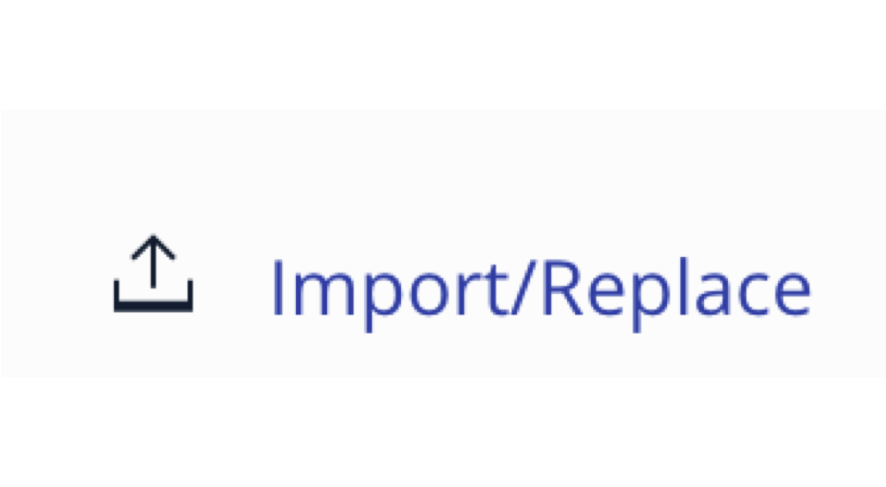

*Read this in other languages: [English](README.md), [中国](README-cn.md).*
# BlockchainNetwork-CompositeJourney

## Build Your First Network (BYFN)

블록체인 애플리케이션을 빌드하는 시리즈 중 첫 번째 과정에 오신 것을 환영합니다. **1 단계**에서는 상품 거래를 위한 비즈니스 프로세스를 하이퍼레저 컴포저(Hyperledger Composer)를 사용하여 BNA (Business Network Archive) 파일을 생성, 생성된 파일을 하이퍼레저 패브릭(Hyperledger Fabric)에 배포하는 방법을 다룹니다. 이 과정은 하이퍼레저 컴포저 샘플버전의 "Hello World"입니다.

하이퍼레저 패브릭은 리눅스 재단 (Linux Foundation®)에서 하이퍼레저 프로젝트 기반에 인큐베이션 프로젝트 중 하나인 표준 블록체인 플랫폼 구현 프로젝트입니다.하이퍼레저 패브릭은 모듈러 아키텍처로 애플리케이션이나 솔루션을 개발하기 위한 토대가 되며, 블록체인 구성 요소인 합의 및 멤버십 서비스 기능 등을 플러그 앤 플레이 방식으로 사용할 수 있습니다.

[2 단계](https://github.com/IBM/BlockchainBalanceTransfer-CompositeJourney)에서는 여러 참가자가 참여하는 복잡한 네트워크를 만들고 액세스 제어 리스트 (ACL)를 사용하여 네트워크 액세스 권한을 제공하는 방법에 대해 자세히 살펴봅니다. 이 과정에서는 하이퍼레저 패브릭을 로컬에서 실행합니다.

[하이퍼레저 컴포저](https://github.com/hyperledger/composer)를 사용하여 기존 자산과 이에 관련된 거래를 포함하는 현재의 비즈니스 네트워크를 신속하게 모델링할 수 있습니다. 여기서 자산(Asset)은 유형 또는 무형의 재화, 서비스 또는 소유물입니다. 비즈니스 네트워크 모델의 한 부분인, 자산을 기반으로 서비스 기능별로 트랜젝션(Transaction)을 정의합니다. 비즈니스 네트워크에 참여중인 참가자는 고유한 ID를 통해 하나의 비즈니스 네트워크나 여러 다른 비즈니스 네트워크에 참여할 수 있는 권한을 갖게 됩니다. 비즈니스 네트워크 정의하는 구성요소는 모델(.cto), 스크립트(.js) 및 ACL(.acl) 파일로 구성되어 아카이브(.bna 파일) 형태로 패키지화 되어 생성되게 됩니다. 그런 다음 아카이브 파일(BNA)을 하이퍼레저 패브릭 네트워크에 배포됩니다.

## 구성 요소
* 하이퍼레저 패브릭
* 하이퍼레저 컴포저
* 도커 (Docker)

## 애플리케이션 워크플로우 다이아그램


1. 네트워크 구성파일 설치하기 a) cryptogen b) configtxgen c) configtxlator d) peer
2. 네트워크 설정하기 a) 네트워크 아티팩트 생성하기 b) 네트워크 시작하기

## 사전 준비

* [Docker](https://www.docker.com/products/overview) - v1.13 또는 그 이상
* [Docker Compose](https://docs.docker.com/compose/overview/) - v1.8 또는 그 이상
* [Node.js & npm](https://nodejs.org/en/download/) - node v6.2.0 - v6.10.0 (v7+ 미지원); npm은 노드 설치와 동시에 제공됩니다.
* [Git client](https://git-scm.com/downloads) - clone 명령 관련하여 필요합니다
*  git - 2.9.x
*  Python - 2.7.x

## Steps
1. [하이퍼레저 컴포저 개발 툴 설치하기](#1-하이퍼레저-컴포저-개발-툴-설치하기)
2. [하이퍼레저 패브릭 시작하기](#2-하이퍼레저-패브릭-시작하기)
3. [Business Network Archive (BNA) 생성하기](#3-business-network-archive-bna-생성하기)
4. [컴포저 플레이그라운드를 사용하여 Business Network Archive 배포하기](#4-컴포저-플레이그라운드를-사용하여-business-network-archive-배포하기)
5. [로컬에 있는 하이퍼레저 컴포저에 Business Network Archive 배포하기](#5-로컬에-있는-하이퍼레저-컴포저에-business-network-archive-배포하기-대체-설치-방안)

## 1. 하이퍼레저 컴포저 개발 툴 설치하기

**주의:** 수퍼유저 `sudo`모드에서 이 명령을 실행해야 할 수 있습니다. `sudo`를 사용하면 허용된 사용자가 보안 정책에 지정된대로 수퍼유저 또는 다른 사용자로 명령을 실행할 수 있습니다.

* `composer-cli` 에는 비즈니스 네트워크 개발에 대한 모든 명령어를 가지고 있습니다. `composer-cli` 를 설치하려면 아래 명령어를 실행하십시오:
```
npm install -g composer-cli@0.16.0
```

* `generator-hyperledger-composer`는 Yeoman 플러그인으로 비즈니스 네트워크용 애플리케이션을 구성 및 생성하게 됩니다. Yeoman은 오픈 소스 클라이언트 측 개발 스택으로, 웹 애플리케이션을 제작하기 전에 필요한 디렉토리 구조 및 기본적인 파일을 생성해 주는 프레임워크입니다. `generator-hyperledger-composer`를 설치하려면 다음을 실행하십시오: 
```
npm install -g generator-hyperledger-composer@0.16.0
```

* `composer-rest-server`는 하이퍼레저 컴포저 루프백 커넥터를 사용하여 비즈니스 네트워크에 연결하고 모델을 추출한 다음, 모델용으로 생성된 REST API가 포함된 페이지를 보여줍니다.(* 루프백(Loopback) : 높은 확장성을 지닌 Open-source Node.js framework 이며, 간단한 코딩만으로 동적으로 end-to-end REST API를 생성해주는 기능을 제공합니다.)`composer-rest-server`를 설치하려면 다음을 실행합니다:
```
npm install -g composer-rest-server@0.16.0
```

* `Yeoman`을  `generator-hyperledger-composer` 구성 요소와 결합하게 되면, 비즈니스 네트워크를 해석하고 이를 기반으로 애플리케이션을 쉽게 생성할 수 있습니다. `Yeoman`을 설치하려면 다음을 실행합니다:
```
npm install -g yo@2.0.0
```

## 2. 하이퍼레저 패브릭 시작하기

먼저 컴포저 프로파일을 작성하기 위해 하이퍼레저 패브릭 관련 도커 파일을 다운로드합니다. 하이퍼레저 컴포저는 연결 프로파일(Connection Profiles)을 사용하여 런타임에 연결합니다. 연결 프로파일은 사용자의 홈 디렉토리에 있는 JSON 문서 형태이며(또는 환경 변수에서 올 수 있는) Composer API 또는 CLI(Command Line Interface)를 사용할 때 참조됩니다. 연결 프로파일을 사용하면 코드와 스크립트를 하나의 런타임 인스턴스에서 다른 런타임 인스턴스로 쉽게 이동할 수 있습니다.

패브릭을 시작하고 다음 명령을 사용하여 컴포저 프로파일을 만듭니다:
```bash
./downloadFabric.sh
./startFabric.sh
./createPeerAdminCard.sh
```  

지금 해볼 것은 아니지만 참고로 알아두십시오 - 아래 명령어를 사용하면 패브릭을 중단하거나 없앨 수 있습니다:
```
./stopFabric.sh
./teardownFabric.sh
```

## 3. Business Network Archive (BNA) 생성하기

이 비즈니스 네트워크는 다음을 정의합니다:

**참가자**
`Trader`

**자산**
`Commodity`

**트랜잭션**
`Trade`

`Commodity`는 `Trader`가 소유하고, `Commodity`의 소유주는 `Trade` 트랜젝션을 제출하여 수정할 수 있습니다.

다음 단계는 비즈니스 네트워크 정의를 위한 BNA (Business Network Archive) 파일을 생성하는 것입니다. BNA 파일은 배포 가능한 유닛으로, 실행을 위해 컴포저 런타임에 배포할 수 있는 파일입니다.

네트워크 아카이브를 생성하려면 다음의 명령을 사용합니다:
```bash
npm install
```
다음의 결과를 확인할 수 있습니다:
```bash
Creating Business Network Archive

Looking for package.json of Business Network Definition
	Input directory: /Users/ishan/Documents/git-demo/BlockchainNetwork-CompositeJourney

Found:
	Description: Sample Trade Network
	Name: my-network
	Identifier: my-network@0.0.1

Written Business Network Definition Archive file to
	Output file: ./dist/my-network.bna

Command succeeded
```

`composer archive create` 명령은 `dist` 폴더에 `my-network.bna`라는 파일을 생성합니다.

Node.js 프로세스에서 '블록체인' 인메모리 상태를 저장하는 임베디드 런타임에 대해 설계한 비즈니스 네트워크를 테스트할 수 있습니다. 이 임베디드 런타임은 전체 패브릭을 구성하는 대신 비즈니스 로직 테스트에 집중할 수 있으므로 단위 테스트에 매우 유용합니다. 

프로젝트 작업 디렉토리 (`BlockchainNetwork-CompositeJourney`)에서 다음 명령을 실행하십시오:
```
npm test
```

다음 결과를 확인할 수 있습니다:
```bash

> my-network@0.0.1 test /Users/laurabennett/2017-NewRole/Code/BlockchainNetwork-CompositeJourney
> mocha --recursive

Commodity Trading
    #tradeCommodity
      ✓ should be able to trade a commodity (198ms)


  1 passing (1s)
```

## 4. 컴포저 플레이그라운드를 사용하여 Business Network Archive 배포하기

[컴포저 플레이그라운드](http://composer-playground.mybluemix.net/)를 열면,자동으로 기본 샘플 네트워크를 가져옵니다. 이전에 플레이그라운드를 사용한 적이 있는 경우, 브라우저 콘솔에서 `localStorage.clear()`를 실행하여 브라우저 로컬 저장소를 지우십시오.

이제 배포 버튼을 클릭하여 `my-network.bna`파일을 가져오가 합니다.
<p align="center">
  
</p>

>[컴포저 플레이그라운드를 로컬에서](https://hyperledger.github.io/composer/installing/using-playground-locally.html) 설정할 수도 있습니다.

다음이 표시됩니다:
<p align="center">
  
</p>

비즈니스 네트워크 정의를 테스트하려면, **Test** 탭을 클릭합니다:

`Create New Participant` 버튼을 클릭합니다
<p align="center">
  
</p>


`Trader` 참여자를 생성합니다:

```
{
  "$class": "org.acme.mynetwork.Trader",
  "tradeId": "traderA",
  "firstName": "Tobias",
  "lastName": "Funke"
}
```
```
{
  "$class": "org.acme.mynetwork.Trader",
  "tradeId": "traderB",
  "firstName": "Simon",
  "lastName": "Stone"
}
```

가장 왼쪽에 있는 Commodity 탭을 하이라이트하고
`traderA`를 소유주로 하여 `Commodity` 자산을 생성합니다:
```
{
  "$class": "org.acme.mynetwork.Commodity",
  "tradingSymbol": "commodityA",
  "description": "Sample Commodity",
  "mainExchange": "Dollar",
  "quantity": 100,
  "owner": "resource:org.acme.mynetwork.Trader#traderA"
}
```

왼쪽 하단에 있는 `Submit Transaction` 버튼을 클릭하고 `Trade` 트랜젝션을 제출하여 Commodity의 소유주를 `commodityA`로 변경합니다:
```
{
  "$class": "org.acme.mynetwork.Trade",
  "commodity": "resource:org.acme.mynetwork.Commodity#commodityA",
  "newOwner": "resource:org.acme.mynetwork.Trader#traderB"
}
```

`Commodity` 레지스트리를 클릭하여 새 소유주를 확인할 수 있습니다. 또한 `All Transactions` 레지스트리를 선택하여 모든 트랜젝션을 볼 수 있습니다.

트랜젝션 뷰의 예:
<p align="center">
  
</p>

## 5. 로컬에 있는 하이퍼레저 컴포저에 Business Network Archive 배포하기 (대체 설치 방안)

하이퍼레저 패브릭에 비즈니스 네트워크를 배포하려면 하이퍼레저 컴포저를 통해 생성한 비즈니스 네트워크 아카이브 (.bna)를 피어로 디플로이 해야하며, 비즈니스 네트워크 관리자가 되려면 새 참가자, ID 및 이와 연관된 카드를 만들어야 합니다. 마지막으로, 네트워크 관리자 비즈니스 네트워크 카드를 사용하려면 생성한 카드정보를 가져오기(import) 기능을 통해 가져와야 합니다. 그 이후에 네트워크가 정상적으로 응답하는지 확인하기 위해 핑(ping) 할 수 있습니다.

디렉토리를 `my-network.bna` 파일이 들어있는 `dist` 폴더로 변경합니다.

`composer runtime install` 명령을 사용하려면 PeerAdmin 비즈니스 네트워크 카드 (이 경우 하나는 미리 만들어져 가져오기 되었습니다)와 비즈니스 네트워크의 이름이 필요합니다. 컴포저 런타임을 설치하려면 다음 명령을 실행하십시오:
```
cd dist
composer runtime install --card PeerAdmin@hlfv1 --businessNetworkName my-network
```

`composer network start` 명령에는 비즈니스 네트워크 카드, 비즈니스 네트워크의 관리자 ID 이름, `.bna` 파일 경로 및 비즈니스 네트워크 카드로 가져올 파일명이 필요합니다. 비즈니스 네트워크를 배포하려면 다음 명령을 실행하십시오:
```
composer network start --card PeerAdmin@hlfv1 --networkAdmin admin --networkAdminEnrollSecret adminpw --archiveFile my-network.bna --file networkadmin.card
```

`composer card import` 명령을 사용하려면 `composer network start`에 지정된 파일 이름이 있어야 카드를 만들 수 있습니다. 사용 가능한 비즈니스 네트워크 카드로 네트워크 관리자 ID를 가져 오려면 다음을 실행합니다:
```
composer card import --file networkadmin.card
```

아래와 같이 입력하면 네트워크를 확인할 수 있습니다:
```
composer network ping --card admin@my-network
```

아래와 같은 결과가 나타납니다:
```
The connection to the network was successfully tested: my-network
	version: 0.16.0
	participant: org.hyperledger.composer.system.NetworkAdmin#admin

Command succeeded
```

배포된 비즈니스 네트워크 (자산/참여자 생성 및 트랜잭션 제출)와 통합하기 위해 컴포저 노드 SDK를 사용하거나 REST API를 생성할 수 있습니다. REST API를 만들려면 composer-rest-server를 시작하고 배포된 비즈니스 네트워크의 접속 정보를 설정합니다. 이제 디렉토리를 프로젝트 작업 디렉토리와 타입으로 변경하고 다음을 입력하여 서버를 시작합니다:
```bash
cd ..
composer-rest-server
```

시작할 때 나타난 질문들에 답하십시오.  그러면 composer-rest-server를 하이퍼레저 패브릭에 연결하고 REST API의 생성 방법을 설정할 수 있습니다.
* Enter `admin@my-network` as the card name.
* Select `never use namespaces` when asked whether to use namespaces in the generated API.
* Select `No` when asked whether to secure the generated API.
* Select `Yes` when asked whether to enable event publication.
* Select `No` when asked whether to enable TLS security.

만약 composer-rest-server 가 성공적으로 시작되었다면 다음의 두 줄을 확인할 수 있습니다:
```
Web server listening at: http://localhost:3000
Browse your REST API at http://localhost:3000/explorer
```

웹브라우저를 열어 http://localhost:3000/explorer 로 이동합니다. 

생성된 REST API를 검사하고 테스트할 수 있도록 LoopBack API Explorer가 웹브라우저에서 표시되어야 합니다. 위의 컴포저 섹션에서 나와있는대로 설명을 따라 비즈니스 네트워크 정의를 테스트하십시오.

## 2 단계를 진행하실 준비가 되었습니다! 
축하합니다 - 이 시리즈의 1 단계를 완성하였습니다 - 이제 [2 단계](https://github.com/IBM/BlockchainBalanceTransfer-CompositeJourney)로 이동합니다.

## 추가 리소스
* [Hyperledger Fabric Docs](http://hyperledger-fabric.readthedocs.io/en/latest/)
* [Hyperledger Composer Docs](https://hyperledger.github.io/composer/introduction/introduction.html)

## License
[Apache 2.0](LICENSE)
