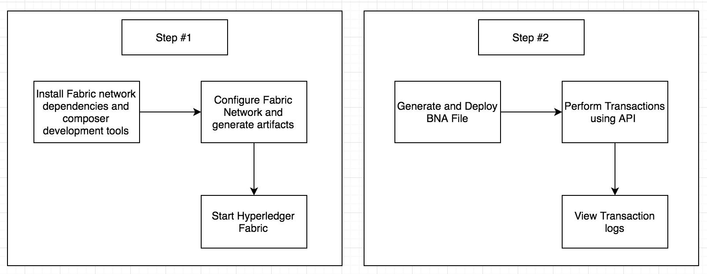
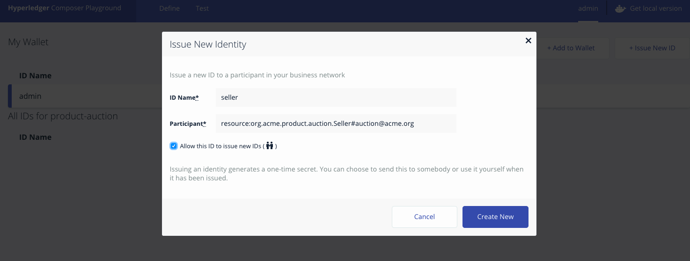
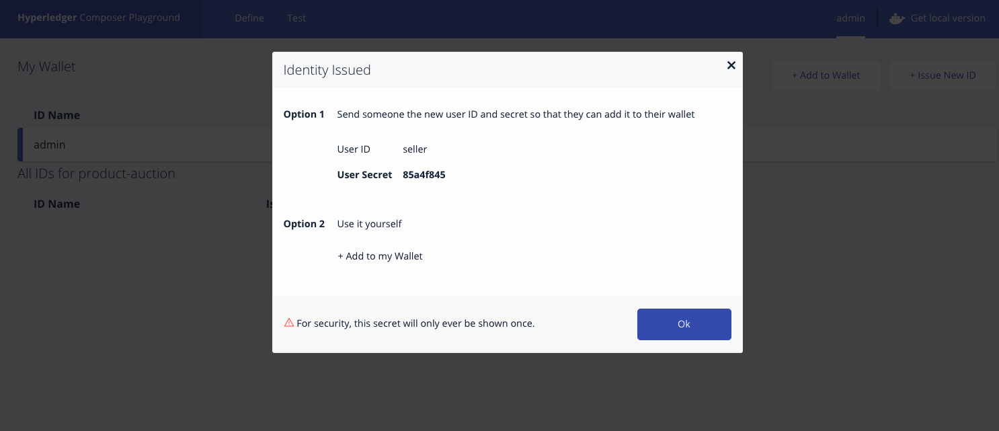
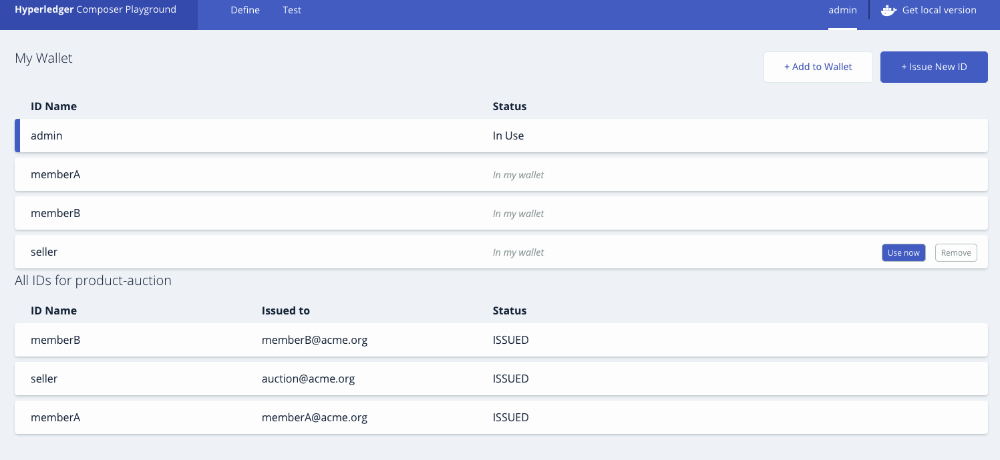
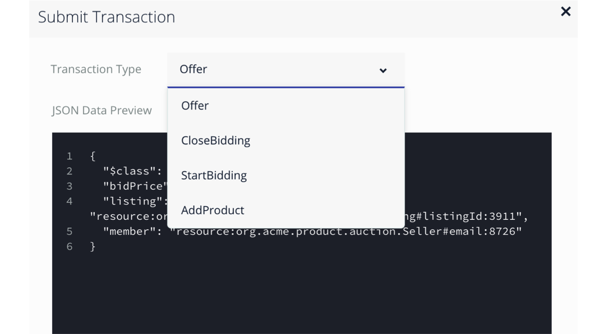
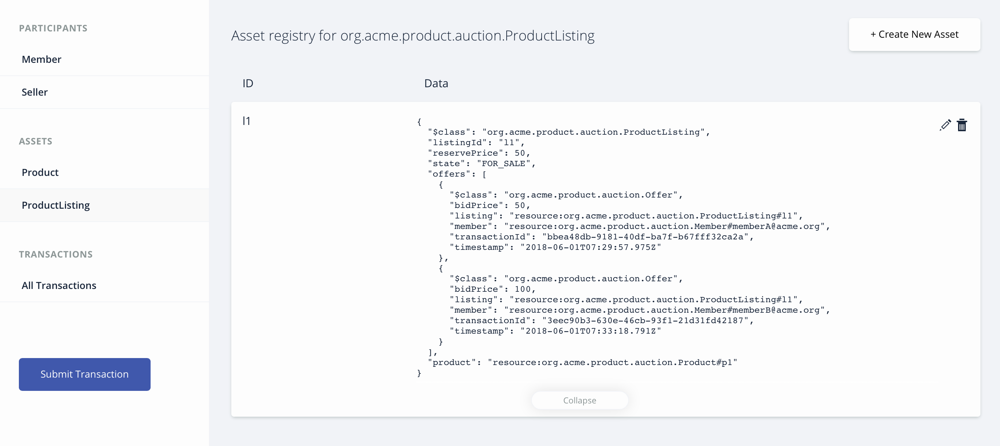
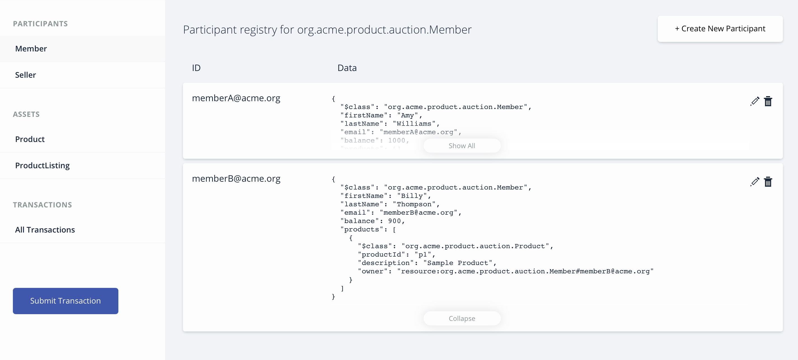
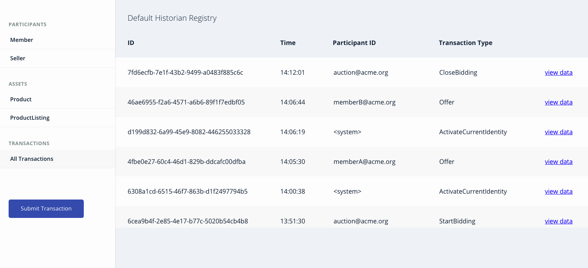

# Hyperledger Composer - 产品拍卖网络
*阅读本文的其他语言版本：[English](README.md)。*

欢迎学习 Hyperledger Composer Composite 学习之旅的第 2 部分。这是 [Composer 网络设置学习之旅的延续](https://github.com/IBM/BlockchainNetwork-CompositeJourney#build-your-first-hyperledger-network)。本次学习之旅将介绍使用 Composer 定义智能合约的更多复杂细节。您将学习如何向区块链应用程序添加多个参与者和访问控制。为此，您将创建一个交互的、分布式的产品拍卖演示网络。您将列出待售的资产（设置一个保留价格），观察满足保留价格的资产在拍卖结束时被自动转移给最高出价者。另外，根据 `permissions.acl` 文件中的访问控制规则 (ACL)，每个参与者都有不同的访问权限级别。访问控制列表 (ACL) 是针对共享和隐私的设置，由 Fabric Composer 运行时自动执行。


这个业务网络定义了以下内容：

**参与者：**
`Member` `Seller`

**资产：**
`Product` `ProductListing`

**事务：**
`AddProduct` `StartBidding` `Offer` `CloseBidding`

在提交 `AddProduct` 事务时调用 `addProduct` 函数。该逻辑允许销售者创建一个产品资产并更新它的注册表。

在产品所有者提交 `StartBidding` 事务时调用 `publishListing` 函数。该逻辑允许销售者以包含其产品和保留价格的产品清单形式创建一个智能合约。

在提交 `Offer` 事务时调用 `makeOffer` 函数。该逻辑简单地检查针对该出价的清单是否仍待售，然后将该出价添加到清单中，然后更新 `ProductListing` 资产注册表中的出价。

在提交 `CloseBidding` 事务供处理时调用 `closeBidding` 函数。该逻辑检查该清单是否仍待售，按投标价格对出价排序，然后如果满足保留价格，则将与该清单相关的产品的所有权转移给最高投标者。资金从购买者的账户转移到销售者的账户，然后在各自的注册表中更新所有修改的资产。

`models` 目录中的 `product.cto` 文件为产品拍卖演示定义一个数据模型，该模型包含资产、参与者和事务的定义。`lib` 目录中的 `logic.js` 文件实现 `product.cto` 文件中定义的事务。  回想一下，`.cto` 文件从资产、参与者和事务方面定义了您的业务网络的结构。

ACL 规则包含在 `permissions.acl` 文件中，用于确定允许哪个用户/角色创建、读取、更新或删除业务网络的领域模型中的元素。默认 `System` 用户拥有所有权限。网络成员拥有所有资源的读取权限，销售者可以创建产品，开始和结束其产品的投标。网络成员可以对该产品清单进行投标。参与者只能访问允许的资源和事务。

## 包含的组件
* Hyperledger Fabric
* Hyperledger Composer
* Docker

## 应用程序工作流图


创建多个事务并添加 ACL
* 添加更多参与者
* 添加访问控制列表
* 查询和调用链代码

## 步骤
1. [生成 Business Network Archive (BNA)](#1-generate-the-business-network-archive-bna)
2. [使用 Composer Playground 部署 Business Network Archive](#2-deploy-the-business-network-archive-using-composer-playground)
3. [将 Business Network Archive 部署到在本地运行的 Hyperledger Composer 上](#3-deploy-the-business-network-archive-on-hyperledger-composer-running-locally)

## 1.生成 Business Network Archive (BNA)

要检查文件的结构是否有效，现在可以为您的业务网络定义生成一个 Business Network Archive (BNA) 文件。BNA 文件是可部署的单元 —— 一个可部署到 Composer 运行时上执行的文件。

使用以下命令生成网络归档文件：
```bash
npm install
```
您会看到以下输出：
```bash
> mkdirp ./dist && composer archive create --sourceType dir --sourceName .-a ./dist/product-auction.bna

Creating Business Network Archive

Looking for package.json of Business Network Definition
	Input directory: /Users/ishan/Documents/git-demo/BlockchainBalanceTransfer-CompositeJourney

Found:
	Description: Sample product auction network
	Name: product-auction
	Identifier: product-auction@0.0.1

Written Business Network Definition Archive file to
	Output file: ./dist/product-auction.bna

Command succeeded
```
`composer archive create` 命令在 `dist` 文件夹中创建了一个名为 `product-auction.bna` 的文件。

可以针对一个嵌入式运行时来测试业务网络定义，该运行时在一个 Node.js 进程中将“区块链”的状态存储在内存中。
从您的项目工作目录，打开 test/productAuction.js 文件并运行以下命令：
```
npm test
```
您应该看到以下输出：
```
> product-auction@0.0.1 test /Users/ishan/Documents/git-demo/BlockchainBalanceTransfer-CompositeJourney
> mocha --recursive

  ProductAuction - AddProduct Test
    #BiddingProcess
      ✓ Add the product to seller list (119ms)
      ✓ Authorized owner should start the bidding (90ms)
      ✓ Members bid for the product (127ms)
      ✓ Close bid for the product (53ms)


  4 passing (2s)
```

## 2.使用 Composer Playground 部署 Business Network Archive

打开 [Composer Playground](http://composer-playground.mybluemix.net/)，其中已在默认情况下导入基本样本网络。
如果以前使用过 Playground，一定要在浏览器控制台中运行 `localStorage.clear()` 来清除浏览器本地存储。现在导入 `product-auction.bna` 文件并单击 deploy 按钮。


要测试 **Test** 选项卡中的这个业务网络定义，请执行以下步骤：


在 `Seller` 参与者注册表中，创建一个新参与者。确保单击了最左侧的 `Seller` 选项卡。

```
{
  "$class": "org.acme.product.auction.Seller",
  "organisation": "ACME",
  "email": "auction@acme.org",
  "balance": 100,
  "products": []
}
```

在 `Member` 参与者注册表中，创建两个参与者。再次单击最左侧的 `Member` 选项卡。

```
{
  "$class": "org.acme.product.auction.Member",
  "firstName": "Amy",
  "lastName": "Williams",
  "email": "memberA@acme.org",
  "balance": 1000,
  "products": []
}
```

```
{
  "$class": "org.acme.product.auction.Member",
  "firstName": "Billy",
  "lastName": "Thompson",
  "email": "memberB@acme.org",
  "balance": 1000,
  "products": []
}
```

现在我们已准备好添加**访问控制**。为此，单击 `admin` 选项卡向参与者发放**新 ID**，并将这些 ID 添加到钱包中。
请按照以下图中所示的操作说明进行操作：

* 单击 Option 2 下的 +add to my Wallet，实际添加到您的钱包。







从 `Wallet tab` 选项卡中选择 `seller id`。现在单击 `test tab` 来执行 `AddProduct` 和 `StartBidding` 事务。



现在单击 `Submit Transaction` 按钮，从下拉列表中选择 `AddProduct` 事务为销售者创建一个产品。


```
{
  "$class": "org.acme.product.auction.AddProduct",
  "description": "Sample Product",
  "owner": "resource:org.acme.product.auction.Seller#auction@acme.org"
}
```
您可以检查产品和销售者注册表来验证事务。

要为上述产品创建一个产品清单，可以从产品注册表复制 `ProductID`。然后提交 `StartBidding` 事务。记得将 `<ProductID>` 替换为您刚复制的产品 ID。
```
{
  "$class": "org.acme.product.auction.StartBidding",
  "reservePrice": 50,
  "product": "resource:org.acme.product.auction.Product#<ProductID>"
}
```

您刚列出了用于拍卖的 `Sample Product`，它的保留价格为 50！
已在 `ProductListing` 注册表中为具有 `FOR_SALE` 状态的产品创建了一个清单。

现在成员参与者可以提交 `Offer` 事务来竞标一个产品清单。

对于每个 `member id`，从 `Wallet tab` 中选择用户 ID。要提交一个 `Offer` 事务，可以选择 `test tab` 并单击 `Submit Transaction` 按钮。
> `ListingID` 是从 `ProductListing` 注册表复制的清单的 ID。

```
{
  "$class": "org.acme.product.auction.Offer",
  "bidPrice": 50,
  "listing": "resource:org.acme.product.auction.ProductListing#<ListingID>",
  "member": "resource:org.acme.product.auction.Member#memberA@acme.org"
}
```

```
{
  "$class": "org.acme.product.auction.Offer",
  "bidPrice": 100,
  "listing": "resource:org.acme.product.auction.ProductListing#<ListingID>",
  "member": "resource:org.acme.product.auction.Member#memberB@acme.org"
}
```

可以检查 `ProductListing` 注册表，查看该产品的所有投标。



现在再次从 `Wallet tab` 选项卡中选择 `seller id`。单击 `test tab`，为该清单提交一个 `CloseBidding` 事务来结束拍卖。

```
{
  "$class": "org.acme.product.auction.CloseBidding",
  "listing": "resource:org.acme.product.auction.ProductListing#<ListingID>"
}
```

这表明 `ListingID` 的拍卖现在已结束，并会触发上面介绍的 `closeBidding` 函数。

要检查产品是否售出，您需要单击 `ProductListing` 资产注册表并检查该产品的所有者。最高的投标是所有者 `memberB@acme.org` 投的，所以 `memberB@acme.org` 应是该产品的所有者。

可以检查具有 `<ListingID>` 的 ProductListing 的状态是否为 `SOLD`。


单击 `Member` 资产注册表，以验证购买者和销售者余额已更新。该产品已添加到购买者 `memberB@acme.org` 的产品列表。



您可以选择 `All transactions` 选项卡来查看所有事务的历史记录。



> 也可以使用默认的 `System user` 来执行所有操作，因为我们在 `permissions.acl` 中有一条规则，用于为 `System user` 授予所有访问权。

## 3.将 Business Network Archive 部署到在本地运行的 Hyperledger Composer 上

请按照[操作说明](https://github.com/IBM/BlockchainNetwork-CompositeJourney#2-starting-hyperledger-fabric) 启动本地 Fabric。
现在将目录更改为包含 `product-auction.bna` 文件的 `dist` 文件夹并键入：
```
cd dist
composer runtime install --card PeerAdmin@hlfv1 --businessNetworkName product-auction
composer network start --card PeerAdmin@hlfv1 --networkAdmin admin --networkAdminEnrollSecret adminpw --archiveFile product-auction.bna --file networkadmin.card
composer card import --file networkadmin.card
```

可以键入以下命令来验证网络已部署：
```
composer network ping --card admin@product-auction
```

您会看到以下输出：
```
The connection to the network was successfully tested: product-auction
	version: 0.16.0
	participant: org.hyperledger.composer.system.NetworkAdmin#admin

Command succeeded
```

要创建 REST API，需要启动 `composer-rest-server`，告诉它如何连接到我们已部署的业务网络。
现在启动该服务器，方法是将目录更改为 product-auction 文件夹并键入以下内容：
```bash
cd ..
composer-rest-server
```

回答启动时提出的问题。这些信息使得 composer-rest-server 能连接到 Hyperledger Fabric，并配置如何生成 REST API。
* 输入 `admin@product-auction` 作为卡名称。
* 在询问是否在生成的 API 中使用名称空间时，选择 `never use namespaces`。
* 在询问是否安全生成的 API 时，选择 `No`。
* 在询问是否启用事件发布时，选择 `Yes`。
* 在询问是否启用 TLS 安全性时，选择 `No`。

**测试 REST API**

如果 composer-rest-server 成功启动，您会看到以下两行输出：
```
Web server listening at: http://localhost:3000
Browse your REST API at http://localhost:3000/explorer
```

打开 Web 浏览器并导航到 http://localhost:3000/explorer

您会看到 LoopBack API Explorer，可以检查和测试已生成的 REST API。按照上面的 Composer 部分给出的说明来测试业务网络定义。

## 准备执行第 3 步！
恭喜您 - 您已经完成这个综合学习之旅的第 2 步 - 请继续执行[第 3 步](https://github.com/IBM/BlockchainEvents-CompositeJourney).

## 附加资源
* [Hyperledger Fabric 文档](http://hyperledger-fabric.readthedocs.io/en/latest/)
* [Hyperledger Composer 文档](https://hyperledger.github.io/composer/introduction/introduction.html)

## 许可
[Apache 2.0](LICENSE)
